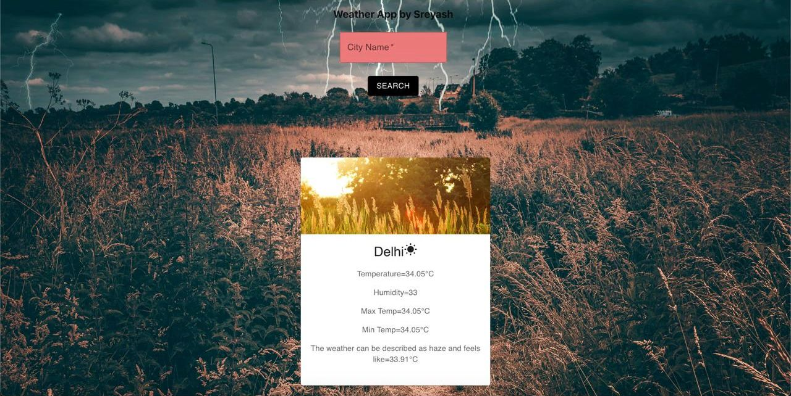

# Simple React Weather App



A simple weather application built using React.js that fetches weather information from the [OpenWeatherMap API](https://openweathermap.org/current).

## Technologies Used

- React.js
- Material-UI for icons, cards, and components
- OpenWeatherMap API

## Features

- Displays current weather information based on user input (city name).
- Uses Material-UI components for a modern user interface.
- Fetches weather data from OpenWeatherMap API.
- Provides temperature, humidity, and weather condition details.

## User Guide

### Setup Instructions
(make sure you install styled components and other font requirements from material UI)
1. **Clone the repository**

   ```bash
   git clone https://github.com/your/repository.git
   cd repository-folder
2. **Install Dependencies**
    ```bash
    npm install
3.**Start the react-app**
   ```bash
    npm run dev


